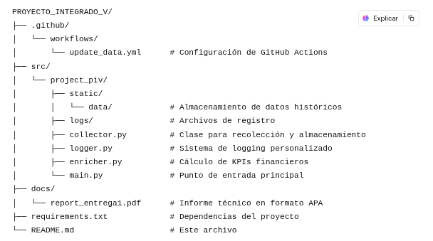

# Proyecto Integrado V: Sistema de recolección de datos financieros.

### Descripción del proyecto

Este proyecto implementa un sistema automatizado para la recolección,almacenamiento y análisis de datos históricos del indicador financiero E-Mini S&P 500 (ES=F) de Yahoo Finance. Desarrollado como parte del curso "Proyecto Integrado V", el sistema utiliza programación orientada a objetos en Python para garantizar una arquitectura modular, mantenible y escalable.

### Características

* Recolección Automatizada: Extracción diaria de datos históricos del E-Mini S&P 500 mediante la API de Yahoo Finance.
* Almacenamiento Dual: Persistencia de datos en formato CSV y base de datos SQLite.
* Actualización Incremental: Adición de nuevos datos sin duplicar registros existentes.
* Registro Detallado: Sistema de logging completo para monitoreo y depuración.
* Integración Continua: Configuración de GitHub Actions para actualización automática diaria.
* Análisis de Datos: Cálculo de indicadores clave de rendimiento (KPIs) financieros.

### Estructura del proyecto

### Requisitos previos
* Python 3.8+
* pandas
* yfinance
* requests
* beautifulsoup4
* sqlite3

### Instalación

1. Clonar el repositorio.
`https://github.com/oalvarez1990/PROJECT_INTEGER_V_2_05.git`

`cd PROJECT_INTEGER_V_2_05`

2. Cree y active un entorno virtual:

`python -m venv venv`
### En Windows:
`venv\Scripts\activate`
### En macOS/Linux:
`source venv/bin/activate`

3. Instale las dependencias:
`pip install -r requirements.txt`

### Uso
Para ejecutar el proyecto, simplemente corra el archivo main.py:

`python src/project_piv/main.py`

### Automatización

El proyecto incluye un flujo de trabajo de GitHub Actions que ejecuta automáticamente el proceso de recolección de datos cada día. Esto garantiza que el conjunto de datos se mantenga actualizado sin intervención manual.

### Metodología

El sistema implementa una arquitectura modular basada en clases:

*Logger: Gestiona el registro de eventos y errores.
*Collector: Responsable de la extracción, limpieza y almacenamiento de datos.
*Enricher: Calcula indicadores financieros a partir de los datos históricos.

## Contribución
Las contribuciones son bienvenidas. Por favor, siga estos pasos:

1. Haga fork del repositorio
2. Cree una rama para su funcionalidad (git checkout -b feature/nueva-funcionalidad)
3. Realice sus cambios y haga commit (git commit -am 'Añadir nueva funcionalidad')
4. Haga push a la rama (git push origin feature/nueva-funcionalidad)
5. Cree un Pull Request

## Enlaces importantes
1. Power bi
Enlace https://app.powerbi.com/links/KEbkC6BvK3?ctid=497e92eb-da55-450d-a1ce-31ff2ad5fc08&pbi_source=linkShare

## Licencia

Este proyecto está licenciado bajo la Licencia MIT - vea el archivo LICENSE para más detalles.

# Autor

Omar Aleiser Alvarez - omar.alvarez@iudigital.edu.co